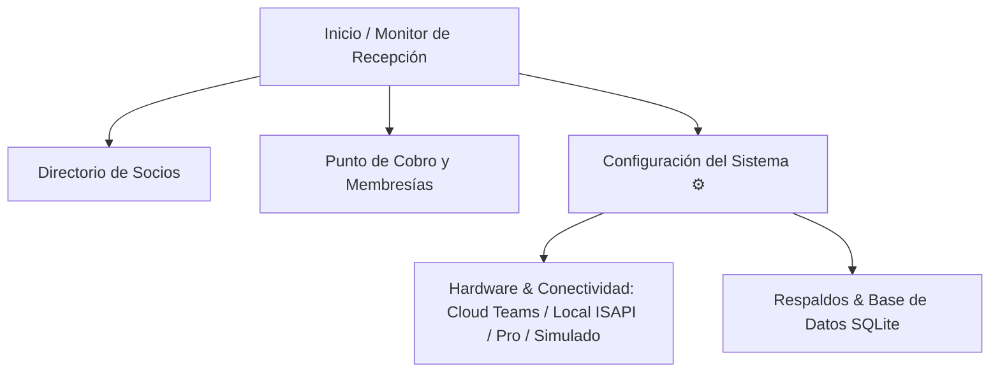
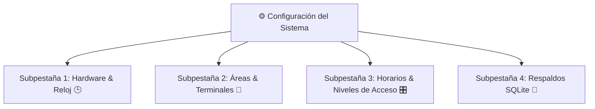

# 📖 Manual de Operación y Guía de Usuario — Sistema de Integración GYM + HikCentral Connect

> **Sistema:** Control de Acceso y Gestión de Membresías para Gimnasios  
> **Versión:** 1.0.0 (Local First + Sincronización Biométrica Hikvision)  
> **Hardware Compatible:** Terminales Faciales Hikvision / HikCentral Connect (ej. MinMoe DS-K1T343MWX)  
> **Base de Datos:** SQLite Nativo en modo WAL con Respaldos Atómicos en Caliente  

---

## 🚀 1. Arranque Rápido del Sistema

Para iniciar el sistema en el gimnasio:
1. Haz doble clic en el archivo `iniciar.bat` ubicado en la carpeta principal del sistema.
2. La terminal iniciará el servidor backend y el sincronizador automático en segundo plano.
3. Se abrirá automáticamente tu navegador web en la dirección:  
   👉 `http://localhost:3000`

---

## 🖥️ 2. Inventario de Pantallas y Funciones

---

### 📍 Pantalla 1: Monitor de Recepción (`/`)

#### Propósito
Es el panel principal que ve el recepcionista durante el turno de entrada. Proporciona una vista en tiempo real del aforo, socios activos, vencimientos inmediatos y el estado del motor biométrico.

#### Qué ve el usuario
- **Tarjetas de Estadísticas Rápidas:**
  - **Socios Activos:** Cantidad de clientes con membresía vigente y acceso permitido en los torniquetes/puertas.
  - **Vencidos Hoy:** Cantidad de socios cuyo acceso caduca en la fecha actual.
  - **Faciales Sincronizados:** Cantidad de socios con fotografía cargada y vinculada en los checadores faciales.
  - **Estado del Motor de Sincronización:** Indicador en verde con pulso activo ("Sincronizador Automático Activo").
- **Barra de Búsqueda Rápida:** Entrada de texto con auto-completado para localizar rápidamente a un socio por nombre o teléfono cuando llega a la recepción.
- **Lista de Acciones Rápidas:** Botón directo para "Nuevo Socio" y "Cobrar Membresía".

---

### 📍 Pantalla 2: Directorio de Socios (`/socios`)

#### Propósito
Control integral del padrón de clientes del gimnasio, captura de datos personales, fotografía facial y estado de cada socio.

#### Detalle Botón por Botón / Control por Control
| Control / Botón | Tipo | Qué captura / valida | Resultado / Efecto |
| :--- | :--- | :--- | :--- |
| **Buscar Socio** | Campo de texto | Texto libre (nombre, apellido o número de teléfono) | Filtra la tabla de socios instantáneamente al escribir |
| **Filtro de Estado** | Selector / Botones | Todos / Vigentes / Vencidos | Filtra la tabla mostrando únicamente la categoría seleccionada |
| **Nuevo Socio** | Botón Primario | Abre el formulario modal de alta de cliente | Despliega ventana emergente para registrar nuevo socio |
| **Input: Nombre Completo** | Texto obligatorio | Mínimo 3 caracteres | Nombre del socio que se registrará en la base y en la terminal |
| **Input: Teléfono** | Texto / Numérico | 10 dígitos | Contacto para avisos y búsqueda rápida |
| **Fotografía Facial** | Carga / Webcam | Archivo JPG/PNG o captura en vivo | Enrola la cara del socio directamente en la terminal biométrica |

---

### 📍 Pantalla 3: Punto de Cobro (`/cobro`)

#### Propósito
Venta rápida de membresías, selección de plan, registro del método de pago y reactivación inmediata del acceso físico en el torniquete.

---

### 📍 Pantalla 4: Configuración del Sistema (`/configuracion`)

#### Propósito
Panel administrativo centralizado con 4 subpestañas especializadas para gestionar la conectividad del hardware, la topología de accesos (áreas y torniquetes), horarios, niveles de acceso vinculados a planes y respaldos del sistema.

---

#### 🎛️ Subpestaña 1: Hardware, Zona Horaria & Reloj del Checador
Permite seleccionar el driver de comunicación y auditar la sincronización horaria de los checadores biométricos:

1. **Hik-Connect Teams (Cloud OpenAPI):**
   - Para gimnasios conectados a internet mediante la plataforma en la nube HikCentral Connect / Teams.
   - Requiere `App Key`, `Secret Key` y el `Access Level ID` del portal.
2. **Hikvision Local Directo (ISAPI LAN):**
   - **Recomendado para operación local sin internet.** Conexión directa a la IP del checador (ej. `192.168.1.100`, puerto `80`, usuario `admin` y contraseña).
   - Inyecta directamente `Valid.beginTime` y `Valid.endTime` en la memoria interna del checador facial.
3. **HikCentral Professional (Servidor Artemis):**
   - Para instalaciones corporativas con servidor HikCentral dedicado on-premise.
4. **Modo Virtual / Simulado:**
   - Permite operar el sistema para demostraciones sin hardware físico conectado.

| Control / Botón | Tipo | Qué captura / valida | Resultado / Efecto |
| :--- | :--- | :--- | :--- |
| **Selector de Driver** | Tarjetas interactivas | Elige el driver activo (Teams / ISAPI / Artemis / Mock) | Adapta los parámetros requeridos dinámicamente |
| **Importar Recursos desde Teams** | Botón de Acción Cloud | Consulta OpenAPI de Teams (`/devices/get`, `/areas/get`, `/accesslevel/list`) | Importa torniquetes, zonas y grupos de acceso a la base de datos sin captura manual |
| **Zona Horaria del Gimnasio** | Selector IANA | Zona horaria local (ej. `America/Mexico_City`, `America/Tijuana`, `America/Cancun`) | Fija la referencia temporal para reportes, cobros y sincronización |
| **Reloj Sistema vs Checador** | Monitor en vivo | Muestra la hora del servidor y la hora leída del checador | Calcula el desfase (drift en segundos) |
| **Sincronizar Reloj del Checador** | Botón de acción | Envía la hora actual y zona horaria al checador (`/ISAPI/System/time`) | Ajusta el RTC del checador evitando accesos indebidos |
| **Probar Conexión en Vivo** | Botón de test | Ejecuta handshake contra la terminal o nube | Confirma estado online, modelo y firmware |
| **Abrir Torniquete (Prueba)** | Botón de pulso | Envía comando de apertura remota manual | Activa el relevador para pruebas de paso |
| **Auditoría Forzada** | Botón de sincronización | Revisa todos los socios en la base de datos | Bloquea vencidos y reactiva vigentes en el hardware |

---

#### 🚪 Subpestaña 2: Áreas & Baterías de Terminales (Topología Híbrida)
Permite modelar sucursales con múltiples torniquetes tanto en modo Cloud Teams como en Local ISAPI:

| Control / Botón | Tipo | Qué captura / valida | Resultado / Efecto |
| :--- | :--- | :--- | :--- |
| **Nueva Área** | Botón / Formulario | Nombre del área (ej. *Acceso General*, *Área de Pesas*, *Zona VIP*) | Registra una zona física en la base de datos local |
| **Origen de la Terminal** | Selector (Píldoras) | 🔌 Local LAN (Directo) vs ☁️ Hik-Connect Teams | Conmuta los campos requeridos según la tecnología de conexión |
| **Serial / Identificador Cloud** | Texto | Número de serie del equipo en Teams | Enlaza la terminal física con la nube de Hik-Connect |
| **IP / Puerto / Contraseña SADP** | Red LAN | Dirección IP local, puerto HTTP y credencial SADP | Habilita control directo por red local sin internet |
| **Acción: Probar Handshake** | Botón por fila | Consulta estado y respuesta del checador | Muestra alerta con estatus online / offline del dispositivo |
| **Acción: Abrir Torniquete** | Botón por fila | Envía pulso de apertura remota | Abre el relevador del checador individual para pruebas |
| **Acción: Sincronizar Reloj** | Botón por fila | Inyecta fecha/hora local al checador | Corrige el RTC de la terminal individual |
| **Acción: Eliminar** | Botón por fila | Confirmación de borrado | Desvincula la terminal de la topología del gimnasio |

---

#### 🎛️ Subpestaña 3: Horarios & Niveles de Acceso
Permite definir turnos y asociar qué áreas físicas pueden cruzarse y en qué horario:

| Control / Botón | Tipo | Qué captura / valida | Resultado / Efecto |
| :--- | :--- | :--- | :--- |
| **Nuevo Horario** | Formulario | Nombre (ej. *Total 24/7*, *Matutino*, *Estudiante*), Días de la semana (Lun a Dom) y Rango Horario (06:00 a 14:00) | Define una regla temporal de cruce |
| **Nuevo Nivel de Acceso** | Formulario | Nombre del nivel, Área, Horario y `ID Teams (Opcional)` | Crea la regla de acceso para asociarla a membresías |
| **Badge Teams / Local** | Indicador visual | Muestra `☁️ Teams ID: X` o `🔌 Local ISAPI` | Identifica qué terminales y plataformas gobiernan la regla |
| **Vinculación con Planes** | Selector en Planes | Asocia un Nivel de Acceso a cada Plan de Membresía | Al cobrar una membresía, el socio recibe automáticamente este nivel |

---

#### 💾 Subpestaña 4: Respaldos & Base de Datos SQLite
| Control / Botón | Tipo | Qué captura / valida | Resultado / Efecto |
| :--- | :--- | :--- | :--- |
| **Crear Respaldo Ahora** | Botón Primario | Ejecuta copia atómica en caliente (`VACUUM INTO`) | Genera archivo fechado `.db` en la carpeta `backups/` sin bloquear cobros |
| **Historial de Respaldos** | Tabla | Lista de copias con fecha, hora y peso en KB | Permite auditar y verificar integridad de las copias |
| **Descargar Respaldo** | Icono de descarga | N/A | Descarga el archivo `.db` a la computadora para guardar en USB |

---

## 🧪 3. Ejemplos Prácticos de Flujo Operativo

### Flujo 1: Registro de un Nuevo Socio con Foto Facial
1. Mario o el recepcionista abre el sistema en `http://localhost:3000`.
2. Da clic en la pestaña **Socios** y presiona el botón **+ Nuevo Socio**.
3. Rellena los datos:
   - **Nombre:** `Carlos Gómez Ramírez`
   - **Teléfono:** `2281234567`
   - **Correo:** `carlos.gomez@gmail.com`
4. En **Fotografía Facial**, sube una foto o usa la cámara web para captura en vivo.
5. Presiona **Guardar Socio**.
6. **Resultado:** El socio queda registrado como *Vencido / Sin Acceso* hasta que realice su primer pago.

### Flujo 2: Cobro de Membresía y Habilitación Inmediata de Acceso
1. Desde la fila de Carlos Gómez, da clic en el botón verde **Cobrar**.
2. En la pantalla de Cobro:
   - Selecciona el plan: **Matutino ($400.00)** (vinculado al Nivel de Acceso "Matutino 6am a 2pm").
   - El sistema calcula la vigencia: `Hoy + 30 días` a las `23:59:59`.
   - Selecciona método de pago e ingresa el importe.
3. Da clic en **Registrar Pago y Otorgar Acceso**.
4. **Resultado en Pantalla:** Alerta verde de pago exitoso.
5. **Resultado en Hardware según el Modo Activo:**
   - **En Hik-Connect Teams (Cloud):** El sistema asigna a Carlos al Access Level ID en la nube.
   - **En Hikvision Local (ISAPI LAN):** El sistema inyecta en el checador a Carlos con su foto y `Valid.endTime = 2026-10-04T23:59:59`.
   - Al colocarse Carlos frente al checador, éste muestra *"Acceso Concedido"* y abre el torniquete de entrada.

### Flujo 3: Corte Autónomo por Vencimiento (Servidor Apagado a Medianoche)
1. Llega el último día de membresía de un socio.
2. El dueño del gimnasio apaga la computadora del servidor a las `22:00`.
3. A las `23:59:59`, la vigencia interna (`Valid.endTime`) grabada en el chip del checador expira.
4. A las `06:00` del día siguiente, antes de que el dueño encienda la computadora, el socio vencido intenta entrar.
5. **Resultado:** El checador facial, guiado por su reloj interno, rechaza el acceso con *"Acceso Denegado / Caducado"*. **No hay fugas de acceso ni fraudes.**

### Flujo 4: Sincronización y Ajuste del Reloj del Checador
1. Si el recepcionista observa en la barra superior (Navbar) un indicador amarillo o rojo de desfase de reloj (ej. `Checador: +45s` o desvío de zona horaria).
2. Va a **Configuración > Hardware & Reloj**.
3. Verifica que la zona horaria corresponda a la de su ciudad (ej. `America/Mexico_City`).
4. Presiona el botón azul **Sincronizar Reloj del Checador**.
5. El sistema inyecta la hora exacta por red al checador. El indicador en la barra superior pasa a verde (`Sincronizado`).

### Flujo 5: Importación Automática desde Hik-Connect Teams y Vinculación Híbrida
1. Mario ingresa a **Configuración > Hardware & Reloj**.
2. Verifica que las credenciales de Hik-Connect Teams estén guardadas y válidas.
3. Presiona el botón verde **`[🔄 Importar Recursos desde Teams]`**.
4. **Resultado Inmediato:** El sistema contacta el OpenAPI de Teams y descarga en lote:
   - Todas las terminales registradas en la nube.
   - Todas las áreas físicas definidas en Teams.
   - Todos los grupos de acceso (Access Levels) de Teams.
5. Mario pasa a la pestaña **Horarios & Niveles de Acceso** y comprueba que los grupos importados tienen su insignia `☁️ Teams ID: X`.
6. En el módulo de cobro o edición de planes, Mario asocia cada plan de membresía (ej. "Membresía Premium") al nivel de acceso correspondiente.
7. Al cobrar en recepción, el sistema inyecta la vigencia al socio tanto en los grupos de Teams en la nube como en las terminales locales ISAPI de forma transparente.
