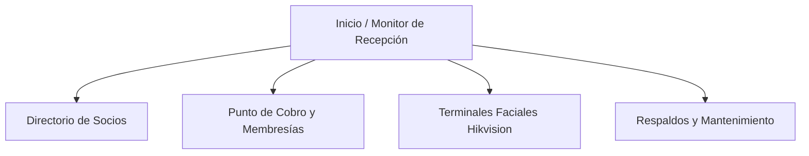

# 📖 Manual de Operación y Guía de Usuario — Sistema de Integración GYM + HikCentral Connect

> **Sistema:** Control de Acceso y Gestión de Membresías para Gimnasios  
> **Versión:** 1.0.0 (Local First + Sincronización Biométrica Hikvision)  
> **Hardware Compatible:** Terminales Faciales Hikvision / HikCentral Connect (ej. MinMoe DS-K1T343MWX)  
> **Base de Datos:** SQLite Nativo en modo WAL con Respaldos Atómicos en Caliente  

---

## 🚀 1. Arranque Rápido del Sistema

Para iniciar el sistema en el gimnasio:
1. Haz doble clic en el archivo `iniciar.bat` ubicado en la carpeta principal del sistema.
2. La terminal iniciará el servidor backend y el sincronizador automático en segundo plano.
3. Se abrirá automáticamente tu navegador web en la dirección:  
   👉 `http://localhost:3000`

---

## 🖥️ 2. Inventario de Pantallas y Funciones

---

### 📍 Pantalla 1: Monitor de Recepción (`/`)

#### Propósito
Es el panel principal que ve el recepcionista durante el turno de entrada. Proporciona una vista en tiempo real del aforo, socios activos, vencimientos inmediatos y el estado del motor biométrico.

#### Qué ve el usuario
- **Tarjetas de Estadísticas Rápidas:**
  - **Socios Activos:** Cantidad de clientes con membresía vigente y acceso permitido en los torniquetes/puertas.
  - **Vencidos Hoy:** Cantidad de socios cuyo acceso caduca en la fecha actual.
  - **Faciales Sincronizados:** Cantidad de socios con fotografía cargada y vinculada en los checadores faciales.
  - **Estado del Motor de Sincronización:** Indicador en verde con pulso activo ("Sincronizador Automático Activo").
- **Barra de Búsqueda Rápida:** Entrada de texto con auto-completado para localizar rápidamente a un socio por nombre o teléfono cuando llega a la recepción.
- **Lista de Acciones Rápidas:** Botón directo para "Nuevo Socio" y "Cobrar Membresía".

---

### 📍 Pantalla 2: Directorio de Socios (`/members`)

#### Propósito
Control integral del padrón de clientes del gimnasio, captura de datos personales, fotografía facial y estado de cada socio.

#### Detalle Botón por Botón / Control por Control
| Control / Botón | Tipo | Qué captura / valida | Resultado / Efecto |
| :--- | :--- | :--- | :--- |
| **Buscar Socio** | Campo de texto | Texto libre (nombre, apellido o número de teléfono) | Filtra la tabla de socios instantáneamente al escribir |
| **Filtro de Estado** | Selector / Botones | Todos / Vigentes / Vencidos | Filtra la tabla mostrando únicamente la categoría seleccionada |
| **Nuevo Socio** | Botón Primario | Abre el formulario modal de alta de cliente | Despliega ventana emergente para registrar nuevo socio |
| **Input: Nombre Completo** | Texto obligatorio | Mínimo 3 caracteres | Nombre del socio que se registrará en la base y en HikCentral |
| **Input: Teléfono** | Texto / Numérico | 10 dígitos | Contacto para avisos y búsqueda rápida |
| **Input: Correo Electrónico**| Texto opcional | Formato de email válido | Datos de contacto para envío de comprobantes |
| **Input: Subir Fotografía** | Archivo imagen | Formato JPG/PNG, máximo 2MB, rostro despejado | Previsualiza la foto y la procesa en Base64 para enviarla al facial |
| **Botón: Guardar Socio** | Botón de acción | Valida campos requeridos | Guarda en SQLite y provisiona al socio en HikCentral Connect |
| **Botón: Cobrar** (en fila) | Botón verde | N/A (usa ID del socio) | Abre el Punto de Cobro con el socio pre-seleccionado |
| **Botón: Sincronizar Facial**| Botón azul | N/A | Fuerza el re-envío del rostro y credenciales al terminal biométrico |

---

### 📍 Pantalla 3: Punto de Cobro y Renovación (`/pos`)

#### Propósito
Caja rápida para registrar cobros de cuotas de gimnasio y activar inmediatamente el acceso en los torniquetes o terminales faciales.

#### Detalle Botón por Botón / Control por Control
| Control / Botón | Tipo | Qué captura / valida | Resultado / Efecto |
| :--- | :--- | :--- | :--- |
| **Buscador de Socio** | Selector interactivo | Búsqueda por nombre o teléfono | Carga los datos del socio y su fecha de vencimiento actual |
| **Plan / Membresía** | Botones de selección | Mensual ($500), Trimestral ($1,350), Anual ($4,800), Visita Día ($80) | Calcula el importe a cobrar y la nueva fecha de vencimiento |
| **Método de Pago** | Selector | Efectivo / Tarjeta Bancaria / Transferencia | Registra la forma de pago en la auditoría contable |
| **Monto Recibido** | Campo numérico | Cantidad entregada por el cliente | Calcula el cambio en caso de pago en efectivo |
| **Registrar Pago y Otorgar Acceso** | Botón de Cobro | Valida importe y socio seleccionado | **1.** Guarda el pago en SQLite. **2.** Extiende la vigencia del socio. **3.** Otorga de inmediato el Nivel de Acceso en HikCentral Connect. **4.** El facial permite el paso al instante. |

---

### 📍 Pantalla 4: Terminales y Hardware Hikvision (`/hardware`)

#### Propósito
Supervisión y control técnico de los dispositivos biométricos MinMoe y configuración del enlace cloud con Syscom / HikCentral Connect.

#### Detalle Botón por Botón / Control por Control
| Control / Botón | Tipo | Qué captura / valida | Resultado / Efecto |
| :--- | :--- | :--- | :--- |
| **Test de Conexión** | Botón de prueba | Verifica AppKey y AppSecret contra los servidores Syscom | Muestra estado `200 OK` y latencia de respuesta |
| **Dispositivos Detectados** | Lista / Cards | Muestra los números de serie y nombres (ej. *Checador Araucarias*) | Confirma si el terminal está en línea |
| **Niveles de Acceso** | Selector / Badge | Muestra los Access Levels de HikCentral (ej. `684236721751815168`) | Asigna a qué puertas/torniquetes tienen permiso los socios |
| **Forzar Sincronización Total**| Botón de emergencia | Revisa todos los socios en la base de datos | Aplica la regla: Vigentes ➔ Acceso Permitido; Vencidos ➔ Acceso Revocado |

---

### 📍 Pantalla 5: Respaldos y Mantenimiento (`/backups`)

#### Propósito
Garantizar la seguridad de la información del gimnasio mediante copias de seguridad atómicas en caliente que no interrumpen el cobro ni el acceso.

#### Detalle Botón por Botón / Control por Control
| Control / Botón | Tipo | Qué captura / valida | Resultado / Efecto |
| :--- | :--- | :--- | :--- |
| **Crear Respaldo Ahora** | Botón Primario | Ejecuta `VACUUM INTO` en la base SQLite | Genera archivo `gyms_backup_YYYYMMDD_HHMMSS.db` en la carpeta `backups/` |
| **Historial de Respaldos** | Tabla | Lista de copias con fecha, hora y peso en MB | Permite auditoría de copias de seguridad existentes |
| **Descargar Respaldo** | Enlace / Botón | N/A | Permite guardar el archivo `.db` en una memoria USB externa |

---

## 🧪 3. Ejemplos Prácticos de Flujo Operativo

### Flujo 1: Registro de un Nuevo Cliente con Foto Facial
1. Mario o el recepcionista abre el sistema en `http://localhost:3000`.
2. Da clic en la pestaña **Socios** y presiona el botón **+ Nuevo Socio**.
3. Rellena los datos de prueba:
   - **Nombre:** `Carlos Gómez Ramírez`
   - **Teléfono:** `2281234567`
   - **Correo:** `carlos.gomez@gmail.com`
4. En **Fotografía del Socio**, da clic en seleccionar archivo y sube una foto frontal bien iluminada del rostro de Carlos.
5. Presiona **Guardar Socio**.
6. **Resultado:** El socio queda guardado. Su estado inicial es *Vencido / Sin Acceso* hasta que realice su primer pago.

### Flujo 2: Cobro de Mensualidad y Habilitación Inmediata de Acceso
1. Desde la fila de Carlos Gómez, da clic en el botón verde **Cobrar**.
2. En la pantalla de Cobro:
   - Selecciona el plan: **Mensual ($500.00)**.
   - El sistema calcula automáticamente la nueva fecha de vigencia: `Hoy + 30 días`.
   - Selecciona **Efectivo** e ingresa `$500.00`.
3. Da clic en **Registrar Pago y Otorgar Acceso**.
4. **Resultado en Pantalla:** Aparece alerta verde de "Pago Registrado Exitosamente".
5. **Resultado en Hardware:** El servidor envía el comando a HikCentral Connect asignando a Carlos el Access Level `684236721751815168` ("Araucarias"). Al colocarse Carlos frente al checador facial, la pantalla del terminal muestra *"Acceso Concedido"* y abre el torniquete.

### Flujo 3: Revocación Automática por Vencimiento (Tolerancia Cero)
1. Llega la medianoche (`00:00:01`) o el momento exacto en que vence la mensualidad de un cliente.
2. El **SyncWorker** en segundo plano detecta que la fecha de vigencia ha expirado.
3. Automáticamente envía la orden de desvinculación a HikCentral Connect (`/accesslevel/member/batch/delete`).
4. **Resultado:** Cuando el socio intenta ingresar esa mañana, el checador facial muestra *"Acceso Denegado / Sin Permiso"* y la puerta permanece cerrada hasta que pase a recepción a renovar.

### Flujo 4: Generación de Respaldo Diario al Cerrar Turno
1. Al terminar la jornada, el recepcionista o administrador va a la pestaña **Respaldos**.
2. Da clic en el botón azul **Crear Respaldo Ahora**.
3. En menos de 1 segundo, el sistema genera la copia atómica `gyms_backup_20260904_210000.db`.
4. El usuario puede copiar dicho archivo a una unidad USB o carpeta de Google Drive / OneDrive para máxima seguridad.
