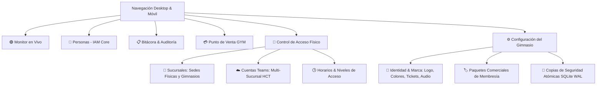

# 📖 Manual de Operación y Guía de Usuario — AccessCore & Gym POS V2.5

> **Sistema:** AccessCore (Motor Agnóstico de Control de Acceso) & Gym POS (Punto de Venta Modular)  
> **Versión:** 2.5.0 (Arquitectura Multi-Cuenta HCT + Desacoplamiento Modular + Autonomía Offline)  
> **Hardware Soportado:** Terminales Faciales Hikvision MinMoe (ISAPI LAN Directo) / Pasarela Cloud Hik-Connect Teams (OpenAPI V2.11 Multi-Tenant) / HikCentral Pro (Artemis)  
> **Base de Datos:** SQLite Nativo en modo WAL con Respaldos Atómicos en Caliente  

---

## 🚀 1. Arranque Rápido del Sistema

Para iniciar el sistema en cualquier computadora de recepción o servidor local:
1. Haz doble clic en el archivo `iniciar.bat` ubicado en la carpeta principal del proyecto.
2. La terminal de Windows inicializará automáticamente el motor backend (Node.js 22 LTS), la base de datos SQLite en modo WAL, el servicio de sincronización Multi-Cuenta y la interfaz web.
3. Se abrirá automáticamente el navegador web predeterminado en la dirección:  
   👉 `http://localhost:3000`

---

## 🏛️ 2. Arquitectura de Navegación

El sistema se estructura en **6 Módulos Maestros**, accesibles mediante la barra superior en computadoras y laptops, o mediante la **Barra de Navegación Táctil Inferior (Bottom Bar)** fija en dispositivos móviles y tabletas:

---

## 🖥️ 3. Inventario Pantalla por Pantalla y Control por Control

---

### 📍 Módulo 1: Monitor de Recepción en Vivo (`/monitor` o `/`)

#### Propósito
Pantalla de supervisión táctica que permanece activa en la computadora de recepción durante todo el turno. Muestra en tiempo real (vía Server-Sent Events sin recargar la página) cada pase de rostro en los torniquetes.

#### Elementos Visuales y Controles
1. **Tarjeta Hero del Último Acceso (Principal):**
   - **Fotografía Facial Oficial:** Foto con la que el socio fue enrolado en el sistema.
   - **Badge de Sentido y Torniquete:**
     - 🟢 `ENTRADA` (verde esmeralda): Acceso al interior de las instalaciones.
     - 🔵 `SALIDA` (azul cian): Egreso o evacuación del gimnasio.
     - 🔄 `BIDIRECCIONAL`: Torniquete reversible de un solo carril.
   - **Identidad del Socio:** Nombre completo y código de persona (`PER-XXXX`).
   - **Semáforo y Diagnóstico de Acceso:**
     - 🟢 **ACCESO PERMITIDO:** Membresía vigente y horario autorizado.
     - 🔴 **DENEGADO — MEMBRESÍA VENCIDA:** Alerta visual destacada. Presenta el botón directo **"💳 Renovar Membresía"**, el cual abre el Punto de Venta precargando al cliente para renovarlo al instante.
     - 🟡 **DENEGADO — FUERA DE HORARIO:** Intento de acceso fuera del turno contratado (ej. membresía matutina checando por la tarde).
     - 🟣 **APERTURA MANUAL:** Registra cuando un operador abrió el relevador desde la consola de administración.
   - **Indicador de Vigencia Restante:** Muestra días de vigencia restantes (*"Vence en 12 días"* o *"Vencido hace 2 días"*).
2. **Botón `Apertura de Emergencia`:**
   - Botón rojo accesible que permite forzar un pulso de relevador en caso de evacuación o contingencia médica.
3. **Métrica de Aforo en Sala:**
   - Muestra el cálculo dinámico: `Entradas del Día - Salidas del Día = Aforo Actual`.
4. **Feed Cronológico de Eventos:**
   - Registro histórico de los últimos 20 accesos con timestamp al segundo, sentido, nombre, torniquete y estado.

---

### 📍 Módulo 2: Directorio Central de Personas (`/personas` — IAM Core)

#### Propósito
Directorio maestro de identidad desacoplado de las reglas de negocio del gimnasio. Gestiona a cualquier persona física que interactúe con los controles de acceso (socios, empleados, entrenadores, personal de limpieza y proveedores).

#### Elementos y Controles
- **Barra de Búsqueda:** Filtro instantáneo por nombre, apellido, teléfono celular o código identificador.
- **Filtros por Tipo de Persona:** Botones conmutadores para ver `TODOS`, `SOCIOS`, `EMPLEADOS` o `🎟️ CORTESÍAS` (filtro semántico inteligente que lista a cualquier cliente con pase de cortesía activo o registrado como visitante).
- **Botón `+ Nueva Persona`:** Abre el modal de enrolamiento biométrico y alta con:
  - `Categoría de Persona`: Selector visual de 3 vías:
    - 🟢 **Socio:** Vinculado a un paquete de membresía comercial y sus puertas asociadas.
    - 🟣 **Personal / Staff:** Acceso operativo de larga duración (1 año) a las puertas seleccionadas.
    - 🔵 **Visitante / Pase de Cortesía:** Acceso temporal configurable (1 día / Hoy, 2 días, 3 días o 7 días). Otorga paso inmediato a los checadores y vence de forma autónoma al finalizar el periodo a las 23:59:59 sin necesidad de plan comercial de pago.
  - `Nombre *`, `Apellidos`, `ID/Código *` (con sugerencia automática) y `Teléfono Celular *`.
  - `Sucursal Base`: Sede principal donde se registrará la persona.
  - `Credencial Facial Biométrica`:
    - Botón **"📷 Webcam"**: Captura en vivo con la cámara web del equipo.
    - Botón **"📁 Subir Foto"**: Carga desde archivo en disco o móvil.
    - Recortador antropométrico con silueta facial 3:4 calibrada para el algoritmo MinMoe.
  - `Puertas y Niveles Autorizados`: Checkboxes para elegir qué torniquetes y puertas físicas se programan en el checador.
- **Botón `☁️ Triaje Checador (Teams)` (Nuevo):**
  - Abre el centro de sincronización, auditoría y purga con el hardware físico.
  - **Selector de Cuenta Teams:** Permite elegir qué cuenta de Teams / sucursal auditar.
  - **Botón `🔍 Escanear Checador`:** Consulta a Teams en tiempo real (`POST /api/hccgw/person/v1/persons/list`) y cruza las personas del hardware contra la base de datos de GymAccess Pro.
  - **Identificación de Estados:**
    - `🟢 Cliente en Sistema`: Persona vinculada con membresía y plan activo.
    - `⚠️ No Registrado en Gym`: Usuario que vive en el checador pero no existe en el sistema (agregado por fuera en Teams o remanente previo).
  - **Acciones Disponibles:**
    - **`[➕ Importar como Socio]`:** Abre el modal de alta prellenado con nombre y foto facial remota de S3. Permite capturar su teléfono y asignarle un plan comercial de inmediato.
    - **`[🗑️ Purgar]`:** Elimina al usuario directamente de la nube de Teams y del checador (`POST /api/hccgw/person/v1/persons/delete`), liberando cupo de los 100 usuarios gratis.
    - **`[🗑️ Purgar Todos los No Registrados]`:** Botón de acción masiva en la barra superior para limpiar en 1 solo clic a todos los usuarios externos no autorizados.
- **Insignias de Estado y Vigencia en Tarjetas:**
  - **Píldora Semáforo de Vigencia (Cabecera de Tarjeta):**
    - 🟢 `X días restantes`: Socio con plan vigente.
    - 🟡 `Vence hoy (11:59 PM)`: Socio en su último día de acceso.
    - 🎟️ `Cortesía (Vence hoy 11:59 PM)`: Prueba gratuita temporal activa.
    - 🔴 `Vencido hace X días`: Socio con pago expirado (bloqueado en hardware).
    - 🟣 `Staff / Acceso Permanente`: Empleado con autorización operativa continua.
    - ⚪ `Sin membresía`: Persona registrada sin plan asignado.
  - 🟢 `Checador`: El socio está sincronizado y dado de alta en el chip de la terminal con su ID de Teams.
  - 🟡 `Pendiente`: El socio tiene membresía pagada pero requiere sincronizarse con la nube de Teams o carece de fotografía.
- **Botón `🎟️ X/3` (Pase de Cortesía en 1 Clic):**
  - Ubicado en cada tarjeta de persona. Indica cuántas cortesías vitalicias ha consumido (`0/3`, `1/3`, `2/3` o `3/3`).
  - Al presionarlo, otorga acceso gratuito válido por el día de hoy hasta las 23:59:59, programa el reloj interno del checador y audita la emisión.
  - Al llegar al límite de 3 cortesías (`3/3`), el botón se deshabilita con candado rojo y el sistema exige una membresía o pase de día pagado.
- **Botón `🪪 Ficha` (Expediente Integral del Socio):**
  Abre la ventana maestra de gestión individual con 4 bloques operativos:
  1. **Fotografía de Carnet 3:4 & Captura Dual:**
     - Marco de credencial estándar 3:4 con previsualización en alta definición.
     - Botón **"📁 Subir PC"**: Permite seleccionar cualquier archivo de imagen (JPG, PNG) desde la computadora y recortarlo con la silueta antropométrica 3:4.
     - Botón **"📷 Webcam"**: Abre la cámara web para tomar una fotografía de frente al momento.
     - Al confirmar el recorte, guarda la foto en disco y la transmite de inmediato a la terminal checadora (`/hccgw/person/v1/persons/photo`).
  2. **Identidad del Socio & Edición de Datos (`✏️ Editar`):**
     - Muestra nombre completo, teléfono, correo electrónico y plan comercial activo.
     - Botón **"✏️ Editar"**: Habilita campos de texto editables para corregir `Nombre`, `Apellidos`, `Teléfono` (opcional) y `Email`.
     - **Candado de Inmutabilidad de ID / Código (`🔒 Fijo`):** Si el socio ya está sincronizado con el hardware físico o la nube de Teams (`🟢 En Checador`), el campo `ID / Código` se bloquea automáticamente en modo solo-lectura con el distintivo `🔒 Fijo` y fondo atenuado. Esto previene que se intente alterar un código ya grabado en la memoria flash de las terminales Hikvision, evitando el error de rechazo en nube `CCF000001: must be same with old code`. Si el socio aún está como `Pendiente Teams`, el código puede ser editado libremente.
     - Botón **"💾 Guardar Datos"**: Actualiza los datos en SQLite y, si el socio ya está enrolado en Teams, llama a `/hccgw/person/v1/persons/update` propagando el nuevo nombre, teléfono o email al hardware en tiempo real sin romper el identificador de hardware.
     - **Traductor Semántico de Errores Teams:** Si la API devuelve un código crudo (ej. `OPEN000010`, `0x6001`, `0x2006`, `0x3003`), el sistema lo traduce a lenguaje humano comprensible en un banner de alerta con instrucciones claras de solución.
  3. **Vigencia & Hardware Autónomo (RTC):**
     - Badge dinámico con días restantes (`X días restantes`, `Vence hoy (11:59 PM)` o `Vencido hace X días`).
     - Selector de calendario y botones de extensión rápida: `+7d`, `+15d`, `+30d`, `+1a`.
     - Botón **"💾 Guardar"**: Inyecta la nueva fecha de corte a las 23:59:59 en el microprocesador del checador.
  4. **Zonas & Puertas Autorizadas:**
      - **Socios con Membresía Activa (`🔒 Regido por Plan`):** Las puertas y torniquetes autorizados son de solo-lectura y se derivan directamente del paquete contratado en caja. Las zonas incluidas muestran el distintivo `🏷️ [Nombre del Plan]` con fondo verde protegido; las zonas excluidas muestran `🔒 No incluido en plan`. Si el socio desea acceso a áreas adicionales (alberca, crossfit o VIP), se actualiza su plan en el módulo de Cobro.
      - **Personal / Staff / Visitantes sin Plan:** Conservan casillas interactivas para asignar y retirar puertas manualmente con un solo clic limpio.
      - **Respuesta de Clic Inmediata:** Optimizado con etiquetas semánticas que eliminan el efecto rebote (*event bubbling*), permitiendo alternar la selección al primer toque.
  5. **🚀 Botón `Forzar Envío al Checador` (1-Clic):**
     - Empaqueta al socio con el objeto estándar `personInfo` (código numérico, nombre, apellido, género, teléfono y vigencia ISO con zona horaria GMT-6).
     - Si el socio no existía en Teams, realiza el alta rápida (`quick/add`) asignándole puertas y foto.
     - Si ya existía, sincroniza su foto, reasigna sus puertas y actualiza la fecha de corte en el chip.
- **Botón `💳 Cobrar` (en tarjeta de socio):** Transfiere el contexto al módulo de Punto de Venta seleccionando automáticamente al socio para renovar o cambiar su membresía.
- **Botón `🗑️ Baja`:** Da de baja lógica a la persona y bloquea sus accesos.

---

### 📍 Módulo 3: Bitácora & Auditoría del Sistema (`/bitacora`)

#### Propósito
Caja negra y centro de auditoría integral desacoplado de las reglas de negocio del gimnasio. Registra cronológicamente cada cruce físico en torniquetes y cada operación del sistema, garantizando trazabilidad total de seguridad y operativa.

#### Pestañas y Controles Operativos
1. **Tarjetas de Métricas del Día (En Vivo):**
   - 🟢 **Accesos Concedidos:** Total de cruces exitosos por reconocimiento facial en torniquetes durante el día.
   - 🔴 **Accesos Denegados:** Intentos de paso rechazados (socios vencidos o personas no reconocidas).
   - 🟣 **Aperturas Manuales:** Aperturas forzadas o de cortesía emitidas desde la computadora de recepción.
   - 🎟️ **Cortesías Otorgadas Hoy:** Número de pases de prueba gratuitos concedidos en la jornada.
2. **Barra de Acciones Globales del Módulo:**
   - 📊 **Botón `Exportar Excel`:** Descarga instantáneamente un archivo `.csv` optimizado con codificación UTF-8 BOM (`\uFEFF`) y delimitadores punto y coma (`;`). Abre de forma directa en Microsoft Excel en español sin requerir asistentes de importación de texto ni alterar acentos o fechas.
   - 📄 **Botón `Imprimir / PDF`:** Abre el diálogo nativo de impresión del sistema operativo configurado con hoja de estilo `@media print` ejecutiva. Imprime un reporte corporativo limpio con el membrete y logotipo del gimnasio, eliminando menús de navegación, botones y barras laterales para exportar a PDF o enviar a impresora física.
   - 🔄 **Botón `Actualizar`:** Recarga en caliente las métricas, accesos físicos y auditoría del sistema en tiempo real.
3. **Pestaña `🚪 Accesos Físicos (Torniquetes)`:**
   - **Filtros por Tipo de Cruce:** Botones conmutadores para auditar:
     * `TODOS`: Flujo continuo de accesos.
     * `✅ CONCEDIDOS`: Pases autorizados con plan vigente.
     * `⏰ VENCIDOS`: Socios con cuota expirada que intentaron checar.
     * `👤 DESCONOCIDOS`: Rostros no registrados en el sistema.
     * `🔓 MANUALES`: Aperturas directas disparadas por el personal de recepción.
   - **Visualización Temporal Dual:** Cada registro muestra con total claridad la **Fecha del Evento** (ej. `07 Sep 2026`) y la **Hora exacta** (ej. `01:47:44 a. m.`) calibrada en horario local de México (GMT-6).
   - **Tabla de Cruces:** Muestra Fecha/Hora, Nombre del Usuario/Socio, Torniquete, Sentido (`ENTRADA` / `SALIDA`), Método de Autenticación (`FACIAL` / `REMOTO_SOFTWARE`) y Estado Semáforo con badges descriptivos.
4. **Pestaña `📋 Operaciones del Sistema`:**
   - Registra movimientos administrativos y de punto de venta:
     * `EMISION_CORTESIA`: Persona que recibió la cortesía, operador que la otorgó y folio de membresía temporal.
     * `COBRO_MEMBRESIA`: Transacciones y cobros registrados en caja.
     * `ALTA_PERSONA`: Nuevos registros de socios, staff o visitantes.
     * `APERTURA_MANUAL`: Quién abrió qué torniquete desde recepción y el resultado de la comunicación con el hardware.
     * `CONFIGURACION`: Cambios en identidad de marca, paquetes o sucursales.
   - **Exportación y Consulta:** Filtro por módulos (`ACCESO`, `MEMBRESIA`, `CAJA`, `SISTEMA`) con visualización de metadatos técnicos en JSON y fecha/hora completa en cada fila.

---

### 📍 Módulo 4: Punto de Venta GYM & Cobro (`/cobro`)

#### Propósito
Gestión de cobros de suscripciones y membresías comerciales, con **inyección autónoma e inmediata de la fecha de corte (`Valid.endTime`) en el hardware físico** (Hikvision MinMoe o Cloud Teams).

#### Flujo Operativo y Controles
1. **Paso 1 — Selección de Socio:**
   - Campo con autocompletado del directorio IAM.
   - Muestra el estado actual del socio, su plan previo y la fecha de corte actual (si tiene días a favor, la nueva vigencia se acumula a partir de su fecha de vencimiento actual; si ya venció, inicia hoy).
2. **Paso 2 — Selección del Plan:**
   - Cuadrícula de tarjetas con los planes vigentes (ej. *Visita Diario $50*, *Mensualidad Regular $600*, *Trimestre VIP $1,600*).
   - Cada tarjeta muestra el precio, la duración en días y el nivel de acceso al que otorga derecho.
3. **Paso 3 — Método de Pago:**
   - Botones selectores: `Efectivo`, `Tarjeta de Débito/Crédito` o `Transferencia / SPEI`.
4. **Paso 4 — Botón `Cobrar y Activar Torniquete Inmediato`:**
   - Genera el registro del cobro con folio fiscal interno `TK-XXXXXX`.
   - Actualiza la fecha de corte de la membresía en SQLite.
   - **Inyecta la nueva fecha de vencimiento en el hardware facial MinMoe o la pasarela Hik-Connect Teams correspondiente.**
   - Genera el comprobante digital en pantalla listo para imprimir o enviar.

> [!IMPORTANT]
> **Autonomía Offline Garantizada:** La fecha de vencimiento reside en la memoria física del checador. Aunque la computadora de recepción se apague, se quede sin luz o pierda internet, el torniquete continuará validando y bloqueando el acceso a clientes vencidos sin depender del servidor.

---

### 📍 Módulo 5: Control de Acceso Físico & Hardware (`/configuracion`)

Este módulo orquesta exclusivamente la infraestructura física del gimnasio (puertas, checadores, torniquetes y niveles de acceso):

---

#### 🏢 Subpestaña 5.1: Sucursales & Sedes Físicas
- Permite registrar las sedes físicas o gimnasios del negocio (ej. *"Sucursal Araucarias"*, *"Sucursal Centro"*).
- Asocia terminales checadoras y torniquetes a cada sucursal física.

---

#### ☁️ Subpestaña 5.2: Cuentas Teams (Multi-Sucursal HCT)

##### Propósito
Permite registrar y gestionar múltiples cuentas de **Hik-Connect Teams (OpenAPI)** dentro de la misma consola.

> [!TIP]
> **Estrategia Multi-Sucursal Gratuita:** El nivel gratuito de Hik-Connect Teams otorga **100 usuarios y 10 puertas por organización**. Si tienes varias sucursales o clientes con menos de 100 socios cada uno, puedes registrar aquí la cuenta de cada sucursal con su respectivo `App Key` y `Secret Key`. El sistema gestionará cada pool de hardware y niveles de forma aislada y transparente.

> [!TIP]
> **Estrategia Multi-Sucursal Gratuita:** El nivel gratuito de Hik-Connect Teams otorga **100 usuarios y 10 puertas por organización**. Si tienes varias sucursales o clientes con menos de 100 socios cada uno, puedes registrar aquí la cuenta de cada sucursal con su respectivo `App Key` y `Secret Key`. El sistema gestionará cada pool de hardware y niveles de forma aislada y transparente.

##### Elementos y Controles
- **Tarjetas de Cuentas Registradas:**
  - `Nombre de la Cuenta`: Identificador descriptivo (ej. *"Sucursal Araucarias"*, *"Sucursal Centro"*).
  - `Credenciales Sanitizadas`: Muestra el `App Key` enmascarado (`4JjbhpQA...`).
  - `Pool de Recursos`: Badge indicativo *"100 Usuarios / 10 Puertas Gratis por Organización"*.
  - `Última Sincronización`: Fecha y hora calibradas automáticamente en horario local del operador (GMT-6 / CST).
- **Botón `📋 Bitácora & Telemetría` (Nuevo):**
  - Abre un cajón lateral (*drawer*) de inspección táctica con refresco automático cada 3.5 segundos.
  - Registra cada pulso de hardware, apertura de puerta y sincronización con:
    - ⚡ **Latencia exacta en ms:** Semáforo de velocidad (🟢 &lt;1.0s Excelente, 🟡 1-3s Normal de Nube, 🔴 &gt;3s Lento / Timeout de 7s).
    - 🌐 **Código de Estado HTTP:** `200 OK`, `408 Request Timeout`, `500`, etc.
    - 🏷️ **Código de Respuesta Teams:** `0 (SUCCESS)` o códigos numéricos oficiales de la API de Hikvision con su mensaje técnico descriptivo.
    - 🗑️ **Botón de Limpieza:** Permite vaciar la tabla de auditoría SQLite en cualquier momento.
- **Botón `Probar Apertura`:**
  - Envía el pulso de apertura al relevador físico e imprime inmediatamente la latencia en milisegundos obtenida en la llamada.
- **Botón `🔄 Sincronizar Recursos Ahora` (por cuenta):**
  - Conecta con la nube de Hikvision usando el token Multi-Tenant.
  - Descarga automáticamente los checadores registrados en esa cuenta y los inserta en **Dispositivos**.
  - Asocia las puertas físicas a **Torniquetes** con su `cloud_resource_id`.
  - Descarga los niveles de acceso existentes en esa cuenta y los clasifica en **Horarios & Niveles**.
- **Botón `+ Registrar Cuenta HCT`:**
  - `Nombre de la Sucursal / Cuenta *`: ej. *"Gimnasio Norte"*.
  - `App Key *`: Obtenido en el portal OpenAPI de Hik-Connect Teams.
  - `Secret Key *`: Clave secreta asociada.
  - `Servidor OpenAPI (Base URL)`: Por defecto `https://ius.hikcentralconnect.com/api`.
  - `Notas`: Observaciones adicionales (dirección física, administrador, etc.).

---

#### 📱 Subpestaña 5.3: Dispositivos & Controladores

##### Propósito
Inventario técnico de todo el hardware biométrico del gimnasio, tanto terminales conectadas por cable de red local (ISAPI LAN) como equipos enlazados a la nube (Hik-Connect Teams).

##### Elementos y Controles
- **Métricas Superiores:**
  - `Total Dispositivos`: Conteo general de terminales.
  - `Terminales Online`: Equipos activos con comunicación comprobada.
  - `Terminales Offline`: Equipos desconectados o sin energía.
  - `En Nube Teams`: Dispositivos gestionados vía Hik-Connect Teams.
  - `En Red Local`: Terminales autónomas conectadas por IP fija.
- **Formulario Inteligente Adaptativo (`+ Registrar Dispositivo`):**
  - `Nombre del Dispositivo *`: ej. *"Checador Facial Entrada Recepción"*.
  - `Modo de Conexión *`:
    - **`Conexión Local Directa (ISAPI LAN)`**:
      - `Dirección IP *`: ej. `192.168.1.150`.
      - `Puerto HTTP`: Por defecto `80`.
      - `Usuario Administrador`: Por defecto `admin`.
      - `Contraseña`: Clave del checador.
    - **`Nube Hik-Connect Teams (Cloud)`**:
      - `Cuenta Teams Asociada *`: Selector de la cuenta HCT a la que pertenece el equipo.
      - `Número de Serie del Dispositivo *`: Serial de fábrica del equipo (ej. `G95801759`).
- **Botones de Operación en Tarjetas de Dispositivos:**
  - **`⚡ Probar Conexión`:** Envía un ping de diagnóstico (HTTP Digest ISAPI o telemetría Cloud) y muestra en pantalla si el equipo está `ONLINE` o `OFFLINE`.
  - **`🕒 Sincronizar Hora`:** Sincroniza el reloj del hardware con la hora exacta del servidor para prevenir rechazos por desfasaje horario.
  - **`🚪 Pulso Relevador`:** Envía una orden de apertura inmediata al contacto seco del equipo para validar el cableado físico.

---

#### 🚪 Subpestaña 5.4: Torniquetes Físicos

##### Propósito
Representa los puntos de paso físicos reales (carriles de torniquetes, puertas abatibles, electroimanes o barreras vehiculares). Cada torniquete se conecta a un relevador de un dispositivo checador.

##### Elementos y Controles
- **Badges de Sentido Direccional:**
  - 🟢 **ENTRADA:** Carril exclusivo para ingreso al gimnasio.
  - 🔵 **SALIDA:** Carril exclusivo para egreso o salida de emergencia.
  - 🔄 **BIDIRECCIONAL:** Carril único reversible con validación en ambos sentidos.
- **Formulario de Registro / Edición (`+ Registrar Torniquete`):**
  - `Nombre / Etiqueta del Torniquete *`: ej. *"Torniquete Entrada Principal A"*.
  - `Sentido de Circulación *`: `ENTRADA`, `SALIDA` o `BIDIRECCIONAL`.
  - `Dispositivo Controlador Asignado *`: Desplegable que muestra el nombre del equipo, su tipo de conexión y su cuenta de origen (ej. `[☁️ Teams: Araucarias] Checador Araucarias (G95801759)`).
  - `Canal de Relevador`: Número de puerta/salida de relevador (`1` para equipos estándar de 1 puerta).
- **Botón `⚡ Probar Apertura`:**
  - Acciona el relevador del torniquete en vivo (vía comando Cloud o ISAPI LAN), permitiendo comprobar que el contacto seco active el electroimán o el brazo del torniquete.

---

#### 🕒 Subpestaña 5.5: Horarios & Niveles de Acceso

##### Propósito
Configura qué puertas pueden abrir los socios y en qué días y horas de la semana. Esta pantalla está dividida en **dos secciones bien diferenciadas para máxima claridad**:

##### Sección 1: Niveles de Acceso Cloud (Hik-Connect Teams)
- Muestra los niveles de acceso configurados en las cuentas de Teams, agrupados por sucursal.
- **Modo de Operación:** Son niveles **gestionados desde la nube**, por lo que se muestran en modo de lectura con la etiqueta `[☁️ Nube Teams: Nombre de Cuenta]`.
- Muestra el ID de nivel en la nube (`cloud_level_id`), los torniquetes asociados y los usuarios vinculados.
- Estos niveles están listos para asociarse a cualquier **Plan de Gimnasio**.

##### Sección 2: Horarios y Niveles de Acceso Locales (ISAPI LAN)
- Permite diseñar horarios semanales y niveles de acceso directos para terminales locales que operan sin internet.
- **Editor de Horarios:** Define bloques horarios de Lunes a Domingo (ej. *Matutino: 06:00 a 12:00*, *Completo: 06:00 a 23:00*).
- **Nivel de Acceso Local:** Combina 1 o varios torniquetes locales con el horario semanal deseado.

---

---

### 📍 Módulo 6: Configuración del Gimnasio (`/ajustes`)

Este módulo desacopla la gestión del negocio y la marca de la infraestructura técnica de torniquetes a través de **3 subpestañas organizadas**:

---

#### 🎨 Subpestaña 6.1: Identidad & Marca (White-Label)

##### Propósito
Permite al dueño del gimnasio personalizar por completo la identidad visual del software, logotipo, paletas de color atléticas (claras y oscuras), tickets de cobro y alertas auditivas de recepción.

##### Elementos y Controles
1. **Identidad del Gimnasio:**
   - `Nombre Oficial del Gimnasio`: Se proyecta dinámicamente en el encabezado de navegación, pantalla de cobro y tickets impresos.
   - `Eslogan / Lema`: Frase distintiva del negocio (ej. *"Fuerza, Salud & Disciplina"*).
   - `Logotipo Oficial`: Carga de PNG con transparencia, SVG, WebP o JPG con vista previa instantánea en la barra superior y opción de restaurar isotipo por defecto.
2. **Paleta de Colores Deportiva (7 Presets Contrastados):**
   - **☀️ 4 Temas Claros (Recepción Iluminada & Ambientes Frescos):**
     - **Clean Studio:** Blanco nieve (`#f8fafc`) con azul eléctrico (`#2563eb`). Clínico, pulcro y moderno.
     - **Sage Wellness:** Menta suave (`#f0fdf4`) con verde esmeralda (`#059669`). Ideal para yoga, pilates y salud.
     - **Solar Amber:** Marfil cálido (`#fffbeb`) con ámbar solar boutique (`#ea580c`). Acogedor y enérgico.
     - **Nordic Slate:** Gris nórdico (`#eef2f6`) con púrpura índigo (`#6366f1`). Alto contraste y corporativo.
   - **🌙 3 Temas Oscuros (Alto Rendimiento & Fuerza):**
     - **Cyber Volt:** Negro asfalto (`#090a0f`) con neón volt (`#ccff00`). Crossfit y urbano.
     - **Onyx Crimson:** Carbón oscuro (`#0d0a0b`) con rojo fuego (`#ff2244`). Boxeo y MMA.
     - **Midnight Ocean:** Azul abisal (`#060b13`) con cian glaciar (`#00e5ff`). Acuático y nocturno.
   - `Color de Acento Hexadecimal Personalizado`: Selector cuentagotas para igualar el pantone exacto del gimnasio.
3. **Membrete de Tickets POS:**
   - Teléfono/WhatsApp, RFC y Dirección física del gimnasio impresos en cada recibo.
   - Pie de ticket configurable con mensajes de bienvenida o políticas internas (ej. toalla obligatoria).
4. **Audio Feedback Sintetizado (Monitor):**
   - Conmutador para activar/desactivar sonidos en la computadora de recepción.
   - Generación sonora vía Web Audio API nativo (bips armónicos para acceso concedido y tono grave para denegado).

---

#### 🏷️ Subpestaña 6.2: Paquetes Comerciales de Membresía

##### Propósito
Catálogo comercial de membresías del gimnasio y su vinculación directa con los niveles de acceso a los torniquetes.

##### Elementos y Controles
- **Tarjetas de Planes:**
  - `Nombre del Plan`: ej. *Pase Diario*, *Mensualidad Total*, *Estudiantes*, *Anualidad*.
  - `Precio`: Tarifa en moneda nacional ($ MXN).
  - `Duración en Días`: Vigencia exacta (ej. 1 día, 30 días, 90 días, 365 días).
  - `Nivel de Acceso Vinculado`: Nivel que se abrirá automáticamente en los torniquetes al cobrar este plan.

---

#### 💾 Subpestaña 6.3: Copias de Seguridad Atómicas (SQLite WAL)

##### Propósito
Mantenimiento preventivo de la base de datos local SQLite y generación de respaldos atómicos en caliente sin interrumpir el cobro ni el paso en los torniquetes.

##### Elementos y Controles
- **Botón `Crear Respaldo Ahora`:**
  - Ejecuta una instrucción nativa `VACUUM INTO` en SQLite. Genera un archivo `.db` íntegro y comprimido en la carpeta `backups/` con la marca de tiempo exacta (ej. `gym_backup_2026-09-06T16-30-00.db`).
- **Historial de Respaldos:**
  - Lista de copias locales con tamaño formateado en KB/MB y fecha de creación. Indicador de integridad `🟢 Íntegro`.
- **Botón `[ 📥 Descargar ]` (Extraer a USB / PC):**
  - Descarga el archivo físico `.db` a través del navegador web con 1 solo clic. Permite guardarlo directamente en una memoria USB externa o enviarlo a almacenamiento en la nube (Estrategia de respaldo 3-2-1).
- **Botón `[ 🔄 Restaurar ]` (Recuperación Atómica):**
  - Despliega un modal de confirmación con advertencia de seguridad. Al confirmar, el sistema cierra los descriptores de SQLite de forma segura (`PRAGMA wal_checkpoint(TRUNCATE)`), sobreescribe la base de datos viva con el respaldo y restablece el servicio sin reiniciar la computadora.
  - *Nota operativa:* Tras una restauración, se recomienda ir a **Personas** y hacer clic en **"Triaje Checador"** para que los checadores físicos queden 100% sincronizados con la base de datos restaurada.

---

## 🛠️ 4. Guías Prácticas de Flujo Operativo

---

### Flujo A: Configurar una Cuenta de Hik-Connect Teams y Vincular Dispositivos
1. Dirígete a **⚙️ Control de Acceso** y haz clic en la pestaña **☁️ Cuentas Teams**.
2. Haz clic en **`+ Registrar Cuenta HCT`**.
3. Ingresa el nombre de la sucursal (ej. *"Sucursal Araucarias"*), tu `App Key` y tu `Secret Key` obtenidos del portal de desarrollador Hik-Connect Teams. Haz clic en **`Guardar Cuenta`**.
4. En la tarjeta de la cuenta recién creada, haz clic en **`🔄 Sincronizar Recursos Ahora`**.
5. El sistema se comunicará con la nube y automáticamente:
   - Registrará tu terminal biométrica en la pestaña **Dispositivos**.
   - Registrará el relevador de la puerta en la pestaña **Torniquetes**.
   - Importará tus niveles de acceso existentes en la pestaña **Horarios & Niveles**.
6. Ve a **Dispositivos**, localiza el checador importado y presiona **`⚡ Probar Conexión`** para confirmar el estado `ONLINE`.

---

### Flujo B: Configurar Múltiples Cuentas Teams para Distintas Sucursales
1. En la pestaña **☁️ Cuentas Teams**, repite el proceso de alta para la **Segunda Sucursal** (ej. *"Sucursal Centro"*).
2. Ingresa el `App Key` y `Secret Key` correspondientes a la segunda organización de Hik-Connect Teams.
3. Presiona **`🔄 Sincronizar Recursos Ahora`** en la tarjeta de *"Sucursal Centro"*.
4. Observa cómo en **Dispositivos** y **Torniquetes** aparecen los checadores de ambas sucursales, cada uno etiquetado con su respectiva cuenta de origen.
5. En **Horarios & Niveles**, verás los niveles de *"Sucursal Araucarias"* y los de *"Sucursal Centro"* separados en bloques independientes, aprovechando los 100 usuarios y 10 puertas gratis de cada cuenta.

---

### Flujo C: Registrar un Checador Local Directo por Cable de Red (Sin Internet / ISAPI)
1. Conecta la terminal facial MinMoe a la red local mediante un cable Ethernet y asígnale una IP estática (ej. `192.168.1.150`).
2. Entra a **⚙️ Control de Acceso** ➔ **📱 Dispositivos**.
3. Haz clic en **`+ Registrar Dispositivo`**.
4. Escribe el nombre (ej. *"Checador Torniquete Local"*).
5. Selecciona el modo **`Conexión Local Directa (ISAPI LAN)`**.
6. Ingresa la IP (`192.168.1.150`), el puerto (`80`), el usuario (`admin`) y la contraseña de la terminal. Haz clic en **`Guardar`**.
7. En la lista de dispositivos, presiona **`⚡ Probar Conexión`** para verificar que el backend establezca comunicación HTTP Digest directa.
8. Presiona **`🕒 Sincronizar Hora`** para calibrar el reloj del equipo.
9. Ve a la pestaña **🚪 Torniquetes**, crea el torniquete físico y vincúlalo a este nuevo checador local.

---

### Flujo D: Enrolar a un Nuevo Socio y Cobrarle su Plan
1. Haz clic en **👥 Personas** en la barra superior y presiona **`+ Nueva Persona`**.
2. Escribe su nombre completo y número de teléfono celular.
3. Selecciona **"📷 Capturar con Webcam"**, pídele al socio que mire a la cámara de la recepción y toma la fotografía facial. Presiona **`Guardar Persona`**.
4. En la tarjeta del socio, haz clic en **`💳 Cobrar Plan`**. El sistema te llevará a la pantalla de cobro con el socio preseleccionado.
5. Selecciona el plan deseado (ej. *"Mensualidad Regular"*), elige el método de pago y haz clic en **`Cobrar y Activar Torniquete Inmediato`**.
6. **Resultado Inmediato:** El sistema registra el pago, genera el ticket y transmite la fecha de vencimiento al checador facial (Cloud o ISAPI). El socio puede caminar directamente al torniquete y checar con su rostro para ingresar.

---

### Flujo E: Personalizar la Marca, Logotipo y Colores del Gimnasio (White-Label)
1. Ve a **⚙️ Control de Acceso** y selecciona la pestaña **🎨 Identidad & Marca**.
2. Modifica el **Nombre Oficial del Gimnasio** (ej. *"Titan Fitness Club"*) y el **Lema** (ej. *"Tu mejor versión empieza aquí"*).
3. Haz clic en el recuadro de **Logotipo Oficial**, selecciona tu imagen PNG con transparencia desde tu computadora y verifica cómo se actualiza de inmediato en la barra superior.
4. En **Paleta de Colores**, elige uno de los 5 presets atléticos (ej. *⚡ Cyber Volt*, *🍊 Sport Blaze* o *🌊 Ocean Flow*) o abre el selector de color hexadecimal para aplicar el tono exacto de tu logotipo.
5. Captura tus datos fiscales y dirección para que aparezcan en los recibos impresos de caja.
6. Haz clic en **`💾 Guardar Configuración de Marca`**. Los cambios se reflejarán instantáneamente en toda la aplicación para todos los operadores.

---

### Flujo F: Emitir un Pase de Cortesía Temporal con Bloqueo Autónomo
1. Entra a **👥 Personas** y presiona **`+ Nueva Persona`**.
2. En el selector superior de categoría, haz clic en **`[ 🔵 Cortesía ]`**.
3. Captura el nombre (ej. *"Carlos Mendoza"*) y su teléfono celular.
4. En la sección **Pase de Cortesía / Invitado**, selecciona la duración:
   - `Hoy (1 d)`: Vence hoy mismo a las 23:59:59.
   - `2 días`, `3 días` o `7 días` (semana de prueba o membresía de cortesía).
5. Toma la fotografía facial con la webcam o cárgala desde archivo, calibra el recorte con la silueta antropométrica y selecciona las puertas autorizadas.
6. Presiona **`Guardar y Enrolar en Checador`**.
7. **Autonomía Edge Computing:** El checador físico recibe al visitante con su vigencia exacta inyectada. Carlos podrá acceder durante el lapso concedido; al llegar el minuto final de su pase, la terminal MinMoe bloqueará el torniquete automáticamente sin intervención manual.
